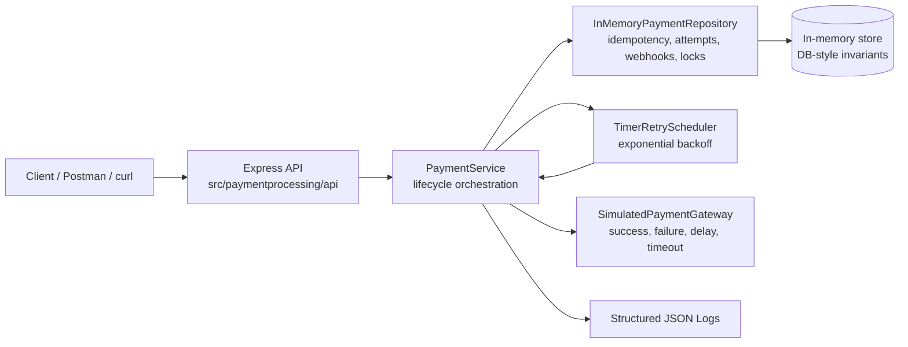
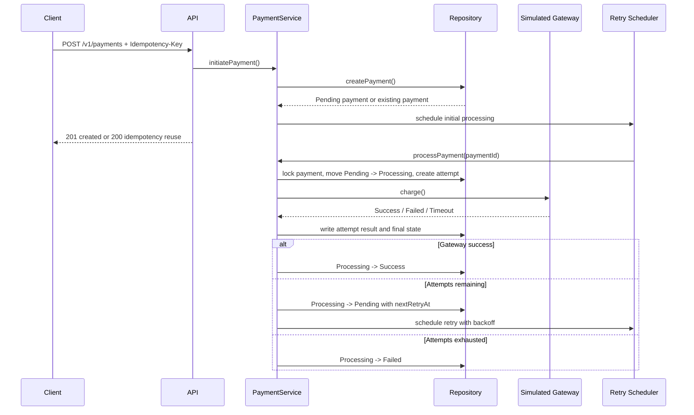

# Payment Processing System

This is used for a fintech-style payment processing service.

The service supports payment initiation, status tracking, retry handling, idempotency, concurrency control, external gateway simulation, webhook handling, and traceable payment events.

The MVP uses an in-memory repository so the assignment runs without external services. The repository keeps the same invariants expected from a database-backed implementation: unique idempotency keys, unique webhook event ids, attempt records, payment-level locking, and versioned updates.

## System Design

For detailed architecture and implementation design, see [docs/HLD.md](docs/HLD.md) and [docs/LLD.md](docs/LLD.md).





## Structure

```text
.
├── docs/
├── scripts/
├── src/
│   └── paymentprocessing/
├── tests/
├── Dockerfile
├── Makefile
├── main.ts
├── package.json
└── tsconfig.json
```

## Run

```bash
npm install
cp .env.example .env
npm run dev
```

API base URL:

```text
http://localhost:3000
```

If port `3000` is already in use:

```bash
PORT=3001 npm run dev
```

## Verify

```bash
scripts/test.sh
npm run lint
npm run build
```

Equivalent Make command:

```bash
make verify
```

## Docker

Build the production image:

```bash
docker build -t payment-processing-system:local .
```

Run with Docker:

```bash
docker run --rm -p 3000:3000 payment-processing-system:local
```

Run with Docker Compose:

```bash
docker compose up --build
```

If host port `3000` is already in use:

```bash
API_PORT=3001 docker compose up --build
```

Makefile shortcuts:

```bash
make docker-build
make docker-up
make docker-down
```

## Core APIs

- `GET /health`
- `POST /v1/payments`
- `GET /v1/payments/:paymentId`
- `GET /v1/payments/:paymentId/events`
- `POST /v1/payments/:paymentId/process`
- `POST /v1/webhooks/gateway`
- `GET /openapi.json`

See [docs/API.md](docs/API.md) for request and response examples.

## Evaluator Flow

Start the API:

```bash
npm run dev
```

In another terminal, verify the service:

```bash
curl -s http://localhost:3000/ | jq
curl -s http://localhost:3000/health | jq
curl -s http://localhost:3000/openapi.json | jq
```


### 1. Initiate Payment

Create a payment with an idempotency key:

```bash
curl -s -X POST http://localhost:3000/v1/payments \
  -H "Content-Type: application/json" \
  -H "Idempotency-Key: order_1001_payment_1" \
  -d '{
    "amountMinor": 125000,
    "currency": "INR",
    "customerId": "cust_001",
    "referenceId": "order_1001",
    "description": "Checkout payment"
  }' | jq
```

Expected result:

- first call returns `created: true`
- payment starts as `Pending`
- background processing starts automatically
- simulated gateway later moves it to `Success`, `Failed`, or back to `Pending` for retry


Copy the returned `payment.id` into a shell variable. Replace the example value with the exact id from your response:

```bash
PAYMENT_ID="pay_replace_with_returned_id"
```

Do not write `${pay_...}` directly. `${...}` is shell-variable syntax, so it only works with a variable name such as `${PAYMENT_ID}`.

You can also call the endpoint with the id directly:

```bash
curl -s "http://localhost:3000/v1/payments/pay_replace_with_returned_id" | jq
```

### 2. Check Status

```bash
curl -s "http://localhost:3000/v1/payments/${PAYMENT_ID}" | jq
```

Expected result after a short delay:

- `Success` when simulated gateway succeeds
- `Pending` when a retry is scheduled
- `Processing` while a gateway attempt is running
- `Failed` when retry attempts are exhausted


### 3. Check Attempts And Events

```bash
curl -s "http://localhost:3000/v1/payments/${PAYMENT_ID}/events" | jq
```

Expected result:

- `attempts` shows gateway attempts, latency, outcome, and error reason if any
- `webhookEvents` shows callback events and ignored reasons when applicable


### 4. Test Idempotency

Run the same initiation request again with the same `Idempotency-Key`:

```bash
curl -s -X POST http://localhost:3000/v1/payments \
  -H "Content-Type: application/json" \
  -H "Idempotency-Key: order_1001_payment_1" \
  -d '{
    "amountMinor": 125000,
    "currency": "INR",
    "customerId": "cust_001",
    "referenceId": "order_1001"
  }' | jq
```

Expected result:

- `created: false`
- `idempotencyReused: true`
- same `payment.id` as the first request


### 5. Trigger Manual Processing

If the payment is still `Pending`, manually trigger processing:

```bash
curl -s -X POST "http://localhost:3000/v1/payments/${PAYMENT_ID}/process" | jq
```

Expected result:

- creates a new attempt when processing is allowed
- returns `payment_already_processing` if another attempt is active
- returns `payment_already_terminal` if payment is already `Success` or `Failed`


### 6. Send Gateway Webhook

Send a simulated gateway success callback:

```bash
curl -s -X POST http://localhost:3000/v1/webhooks/gateway \
  -H "Content-Type: application/json" \
  -d "{
    \"providerEventId\": \"evt_manual_1001\",
    \"paymentId\": \"${PAYMENT_ID}\",
    \"gatewayPaymentId\": \"gw_manual_1001\",
    \"status\": \"success\",
    \"rawPayload\": {
      \"source\": \"manual_test\"
    }
  }" | jq
```

Expected result:

- if the payment is non-terminal, webhook is accepted and payment becomes `Success`
- if the payment is already `Success`, webhook is recorded and ignored with `already_terminal_same_status`
- if the payment is already `Failed`, webhook is recorded and ignored with `terminal_state_conflict`


### 7. Test Duplicate Webhook

Run the same webhook request again with the same `providerEventId`:

```bash
curl -s -X POST http://localhost:3000/v1/webhooks/gateway \
  -H "Content-Type: application/json" \
  -d "{
    \"providerEventId\": \"evt_manual_1001\",
    \"paymentId\": \"${PAYMENT_ID}\",
    \"gatewayPaymentId\": \"gw_manual_1001\",
    \"status\": \"success\"
  }" | jq
```

Expected result:

- `accepted: false`
- `ignoredReason: duplicate_callback`


### 8. Test Conflicting Webhook

Send a failed callback after a successful payment:

```bash
curl -s -X POST http://localhost:3000/v1/webhooks/gateway \
  -H "Content-Type: application/json" \
  -d "{
    \"providerEventId\": \"evt_manual_conflict_1001\",
    \"paymentId\": \"${PAYMENT_ID}\",
    \"gatewayPaymentId\": \"gw_manual_1001\",
    \"status\": \"failed\"
  }" | jq
```

Expected result:

- terminal status is not overwritten
- conflicting callback is recorded with `terminal_state_conflict`


### 9. Test Validation Error

Send an invalid minor-unit amount:

```bash
curl -s -X POST http://localhost:3000/v1/payments \
  -H "Content-Type: application/json" \
  -H "Idempotency-Key: order_invalid_payment_1" \
  -d '{
    "amountMinor": 19.99,
    "currency": "INR"
  }' | jq
```

Expected result:

- HTTP `400`
- `VALIDATION_ERROR`
- no payment is created


### 10. Clean One-Line Smoke Test

```bash
curl -s http://localhost:3000/ | jq
curl -s http://localhost:3000/health | jq
curl -s http://localhost:3000/openapi.json | jq '.info, .paths'
```
