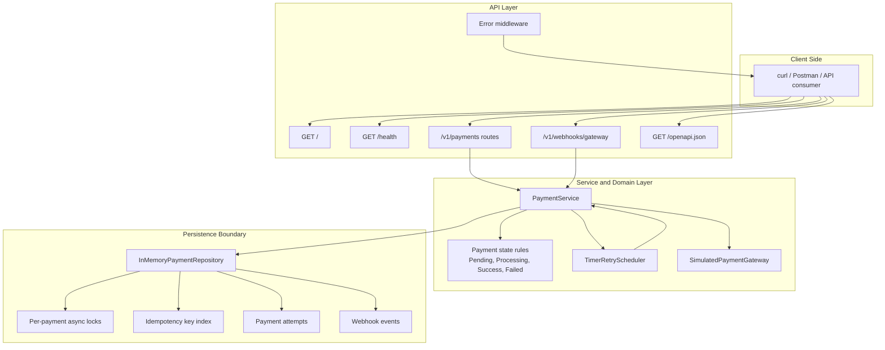
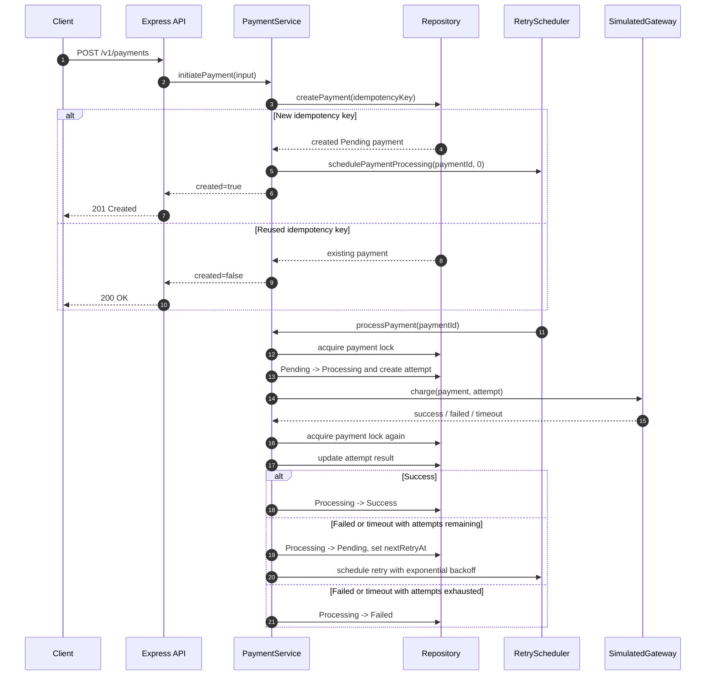
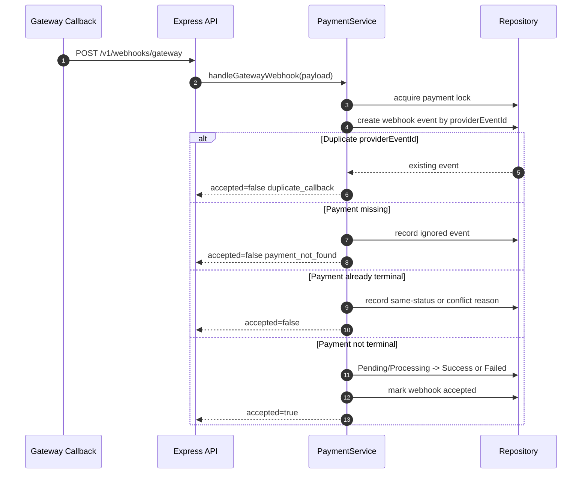

# High-Level Design

## Goal

Build a Node.js payment processing backend that behaves like a small payment gateway integration layer. It demonstrates payment lifecycle management, retry handling, idempotency, concurrency control, gateway failure handling, and webhook consistency.

## Components

- API layer: Express REST endpoints under `/v1`.
- Service layer: `PaymentService` owns lifecycle orchestration and state transitions.
- Repository layer: `InMemoryPaymentRepository` models database-style persistence, unique idempotency keys, attempt records, webhook records, and per-payment locks.
- Gateway layer: `SimulatedPaymentGateway` returns random success, failure, delay, or timeout outcomes.
- Retry scheduler: `TimerRetryScheduler` schedules retry processing with exponential backoff.
- Logging: structured JSON logs for lifecycle events, attempts, retries, webhooks, and errors.

## Component Diagram

## Runtime Flow

1. Client initiates a payment with an `Idempotency-Key`.
2. Repository creates a `Pending` payment or returns the existing payment for the key.
3. Runtime schedules payment processing.
4. Service moves the payment to `Processing`, creates an attempt, and calls the simulated gateway.
5. Gateway returns success, failure, or timeout.
6. Service moves the payment to `Success`, schedules retry by returning to `Pending`, or marks it `Failed`.
7. Webhooks can asynchronously update non-terminal payments and are deduplicated by provider event id.

## Runtime Sequence

## Webhook Sequence

## Production Notes

The assignment keeps one process and one repo. In production, the same boundaries map cleanly to PostgreSQL tables, row-level locking, background workers, a durable queue, rate limiting, circuit breakers, and cloud deployment.
