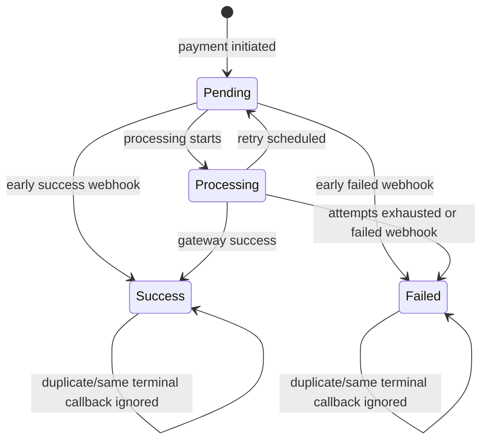
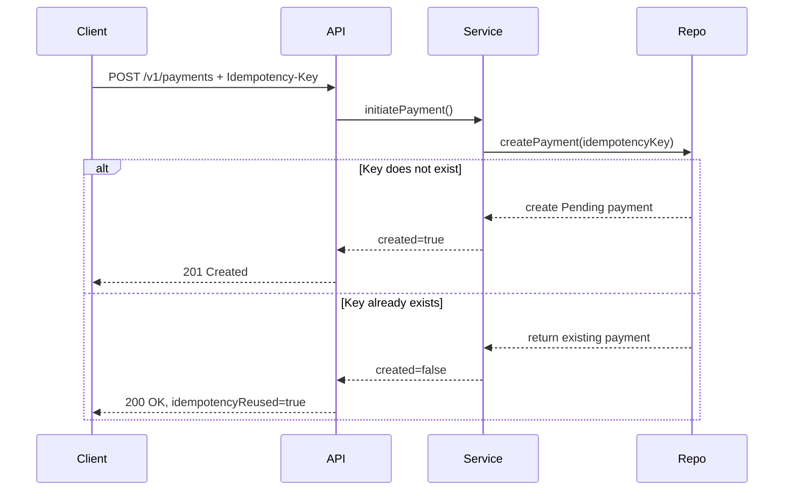
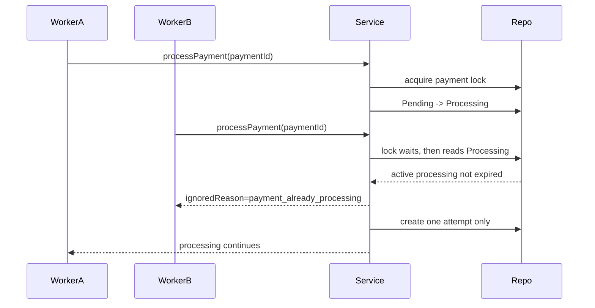
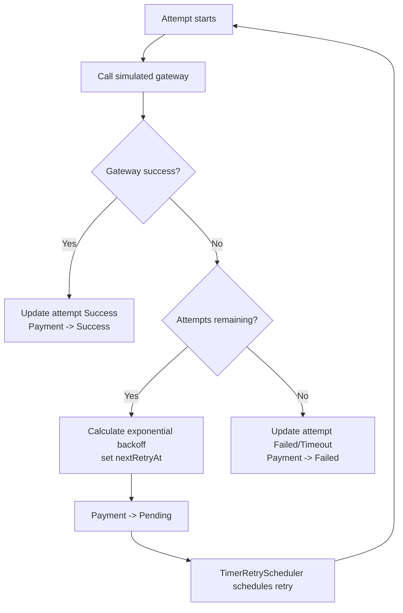
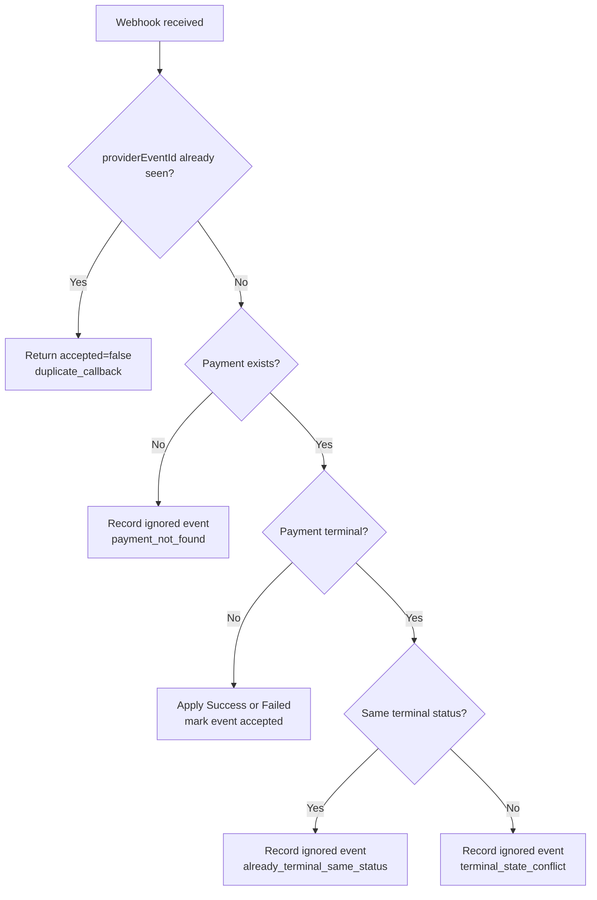
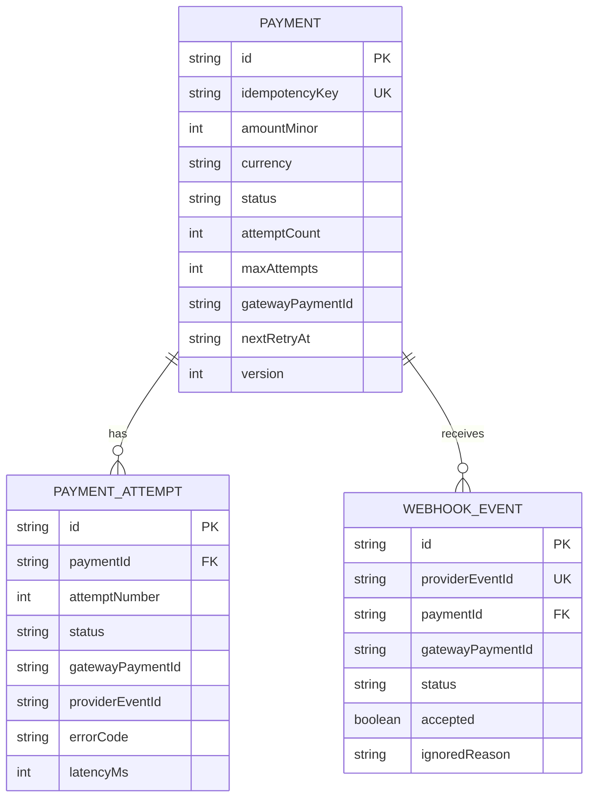

# Low-Level Design

## Payment States

Supported payment states:

- `Pending`
- `Processing`
- `Success`
- `Failed`

Allowed transitions:

```text
Pending -> Processing
Pending -> Success
Pending -> Failed
Processing -> Pending
Processing -> Success
Processing -> Failed
```

Terminal states:

```text
Success
Failed
```

Terminal states are not overwritten by later callbacks or gateway results.



## Idempotency

`POST /v1/payments` requires an `Idempotency-Key` header.

The repository keeps a unique idempotency-key index. If the same key is reused, the existing payment is returned with `idempotencyReused: true`.



In a SQL implementation, this maps to:

```sql
CREATE UNIQUE INDEX payments_idempotency_key_uq ON payments (idempotency_key);
```

## Concurrency Control

The service uses a per-payment async lock and the `Processing` state to prevent parallel processing of the same payment.

Processing flow:

1. Acquire payment lock.
2. Reject terminal payments.
3. Reject active `Processing` payments unless the processing window expired.
4. Move `Pending` to `Processing`.
5. Create a payment attempt.
6. Release lock while the gateway call runs.
7. Re-acquire lock and apply the result defensively.

In PostgreSQL, this maps to `SELECT ... FOR UPDATE` around the payment row.



## Retry Logic

Retries use bounded exponential backoff:

```text
delay = min(base_delay_ms * 2^(attempt_number - 1), max_delay_ms)
```

When the gateway fails or times out:

- If attempts remain, the payment returns to `Pending` with `nextRetryAt`.
- If attempts are exhausted, the payment moves to `Failed`.



## Gateway Simulation

`SimulatedPaymentGateway` introduces:

- random success
- random failure
- random latency
- timeout when latency exceeds configured request timeout
- random timeout outcome

No real payment provider is called.

## Webhook Handling

Webhook events are deduplicated by `providerEventId`.

Rules:

- Missing payment: record event and ignore.
- Duplicate callback: return the original event and ignore.
- Non-terminal payment: apply `success` or `failed`.
- Terminal payment with same status: ignore as already terminal.
- Terminal payment with different status: record conflict and ignore.



## Data Consistency

The in-memory repository models the production invariants expected from a database:

- unique idempotency keys
- unique webhook provider event ids
- append-only attempt records
- append-only webhook event records
- payment-level lock around state changes
- version increments on payment updates

For a production version, this should be implemented with PostgreSQL transactions, row-level locks, unique constraints, and a durable worker queue.


